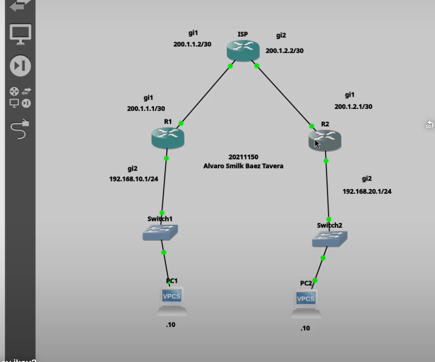
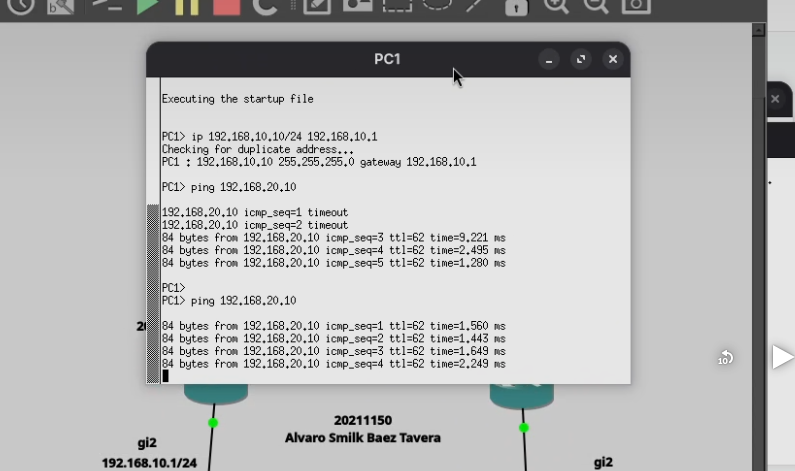

# VPN Site-to-Site Basada en Políticas (Policy-Based VPN) con IPSec IKEv2

## Descripción

En esta práctica se implementó una VPN Site-to-Site basada en políticas utilizando IPSec con IKEv2 sobre routers Cisco CSR1000v IOS XE 16.7.1. La VPN permite proteger la comunicación entre dos redes LAN remotas mediante asociaciones de seguridad establecidas con IKEv2, garantizando la confidencialidad, integridad y autenticación del tráfico que circula entre ambas sedes.

---

# Objetivo

Implementar una VPN Site-to-Site basada en políticas utilizando IPSec con IKEv2 para establecer una comunicación segura entre dos redes privadas a través de una red pública.

---

# Topología

La topología está compuesta por:

- Router R1
- Router ISP
- Router R2
- Switch LAN 1
- Switch LAN 2
- PC1
- PC2

---

# Direccionamiento IP

## Router R1

| Interfaz | Dirección |
|----------|-----------|
| GigabitEthernet1 | 200.1.1.1/30 |
| GigabitEthernet2 | 192.168.10.1/24 |

---

## Router ISP

| Interfaz | Dirección |
|----------|-----------|
| GigabitEthernet1 | 200.1.1.2/30 |
| GigabitEthernet2 | 200.1.2.2/30 |

---

## Router R2

| Interfaz | Dirección |
|----------|-----------|
| GigabitEthernet1 | 200.1.2.1/30 |
| GigabitEthernet2 | 192.168.20.1/24 |

---

## Equipos finales

### PC1

**IP:** 192.168.10.10/24

**Gateway:** 192.168.10.1

### PC2

**IP:** 192.168.20.10/24

**Gateway:** 192.168.20.1

---

# Parámetros utilizados

| Parámetro | Valor |
|-----------|-------|
| Tipo VPN | Site-to-Site Basada en Políticas |
| IKE | Version 2 |
| Encriptación | AES-256 |
| Integridad | SHA-256 |
| Grupo DH | 14 |
| Autenticación | Pre-Shared Key |
| Clave Compartida | Cisco123 |
| IPSec | ESP-AES-256 / ESP-SHA256-HMAC |

---

# Configuración

La configuración completa de los dispositivos se encuentra disponible en la carpeta **scripts** del repositorio.

- ISP
- Router R1
- Router R2

---

# Funcionamiento

La VPN Site-to-Site basada en políticas protege únicamente el tráfico definido como interesante mediante las políticas configuradas en ambos routers.

Cuando un equipo de la red **192.168.10.0/24** envía información hacia la red **192.168.20.0/24**, los routers negocian una asociación de seguridad utilizando **IKEv2**. Una vez establecida la negociación, IPSec cifra el tráfico antes de enviarlo por la red pública.

Al llegar al router remoto, el tráfico es descifrado y entregado a la red de destino, permitiendo una comunicación segura entre ambas LAN.

---

# Evidencias

## Topología

---

## Comunicación entre LANs

La conectividad fue verificada realizando un **ping desde la PC1 (192.168.10.10) hacia la PC2 (192.168.20.10)**, comprobando el correcto funcionamiento de la VPN Site-to-Site basada en políticas utilizando IPSec con IKEv2.

---

# Verificación

El funcionamiento de la VPN fue comprobado mediante pruebas de conectividad entre los equipos finales, verificando la comunicación exitosa entre ambas redes LAN a través del túnel IPSec.

---

# Video demostrativo

La demostración del funcionamiento de la VPN Site-to-Site basada en políticas utilizando IPSec con IKEv2 se encuentra disponible en el siguiente enlace:

https://youtu.be/hZGoucF9r5A

---

# Autor

**Alvaro Baez Tavera**

**Matrícula:** 20211150

**Instituto Tecnológico de las Américas (ITLA)**

**Tecnólogo en Ciberseguridad**
